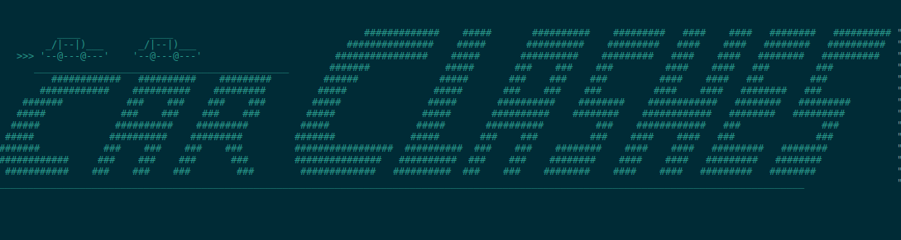

# PROJECT TITLE: Car Clashes -Ultimate

# DESCRIPTION:
                It is a school project made in class 10th, using java on blueJ IDE. 
                Its is Dice based (Ludo like) Single / Double PlayerGame.
                Player race with opponent with Car whose moves are decided by throwing Dice.
                Dice is being thrown Randomly by the program and the car moves accordingly.
                The one who finishes all the laps wins..

# VERSION or DATE:
                April , 2013 (School class 10th)

# TECHNOLOGY USED: 
                 java , BlueJ , Random Probability , Game

# AUTHORS: Sckorpio

# USER INSTRUCTIONS:
                  --Download the project
                  --Build the project in Bluej IDE
                  --Run the main (RUN) file object

